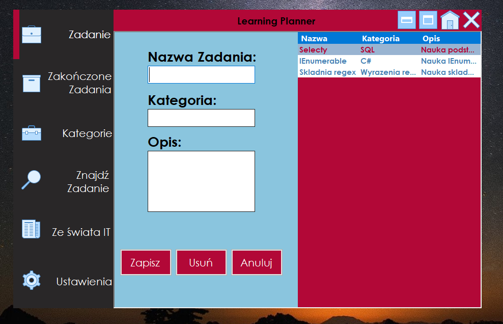
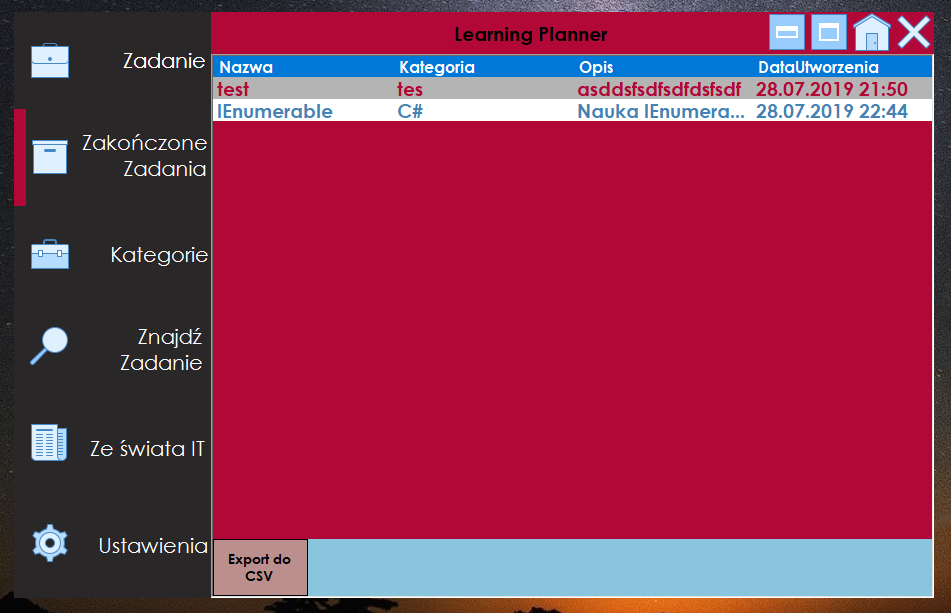
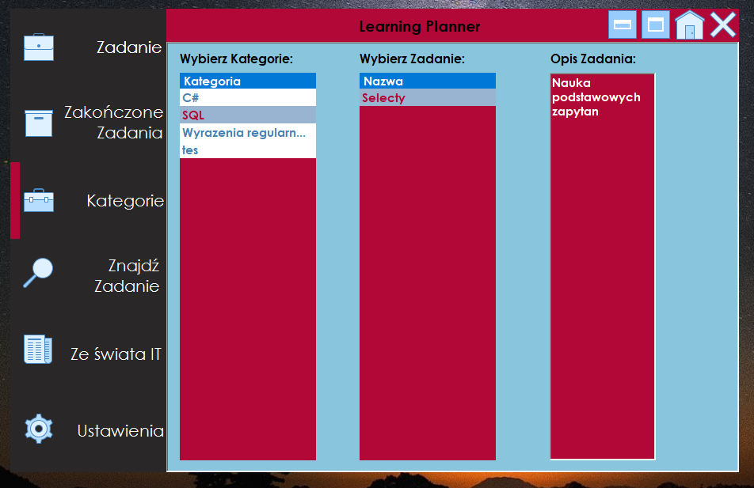

# LearningPlanner
Description: It is a desktop application connected to database. Technologies used in project: C#, Windows Forms, Entity Framework, LINQ, GDI, MS SQL, Azure

Usage: After running program you will see motivational quotation randomly selected from database. Next You have to register account for using aplication. After registered account you can log in to the app and use it ;)
Insinde application you will see 6 submenus on the left side:
1. Tasks(Zadania) - Here you can create, read, update and delete tasks. Each task contains "Name,category, description, status, creation time". Also you can double click into any task and see details of clicked task and there is a button "End task (zakoncz zadanie) which moving task from this submenu to Completed Tasks (Zakonczone zadania) submenu.
2. Completed Tasks (Zakonczone zadania) - Here you can see all Completed tasks moved from Tasks submenu. Also you can export all finished tasks to .CSV file. Here you can also double click each task to see details and you can modify description after clicking "Edit (Edytuj).
3. Category (Kategorie) - Here you can sort tasks by category and see description of each task.
4. Find Task (Znajdz Zadanie) - Here you can find all tasks by filtering them with selected criteria.
5. From IT World (Ze swiata IT) - Here you load RSS Channel to RSS Reader by click one and press "ADD(dodaj)" or you can type any RSS channel link manually. Lower you select web site or you can type any link also manually and press button "Load site (zaladuj strone) to see website. Lower you have sounds and you can select track (calm, classic , relax). On the left of music you will see font change settings which allows you select font. One the left of font settings you will see 3 buttons. 
- Default settings(ustawienia domyslne) - Pressing change all application settings to default values.
- Report an error(zgłoś błąd) - Here you can report error or write message to application administrator. Important here is to fill correct email addres to receive response from administrator.
- About authors(O autorach) - Here you can see a simple messagebox with authors Names, Surnames and emails.
6. Settings(Ustawienia) - In right corner you can change color of background application. The color change is set using 3 trackbars RGB.
To save color changes you have to press "SAVE(zapisz). 

Pics: 

Application is created by 2 people: 
https://github.com/destrojed/
https://github.com/Rosomax/

This application is non commercial. It was created for learning some stuffs ;). Enjoy!
